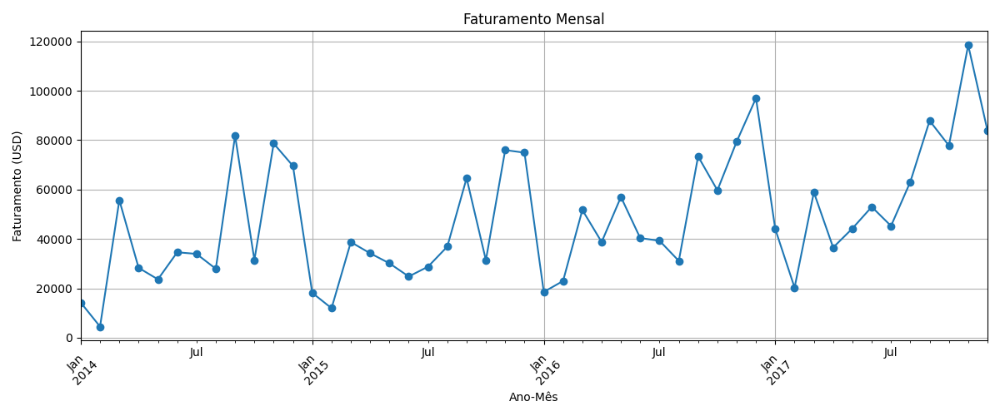
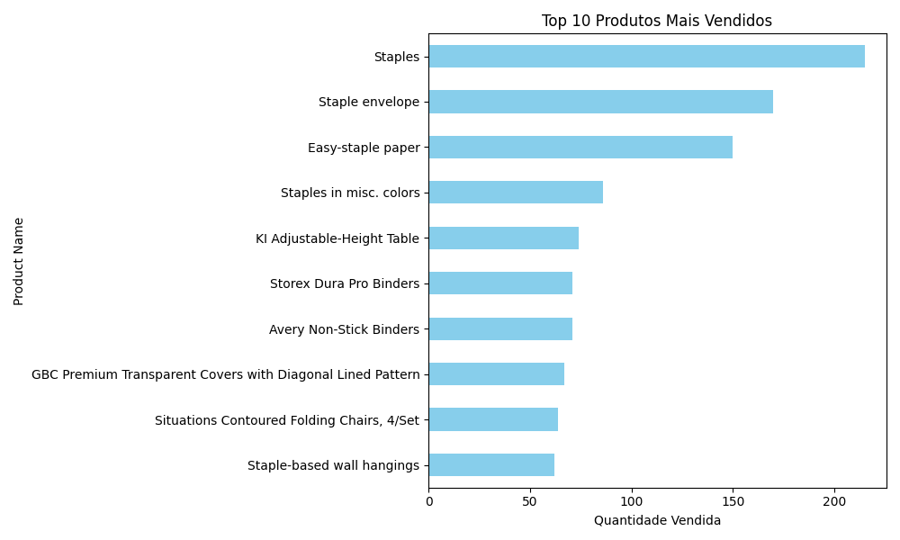

# 📊 Análise de Dados - Superstore

Este projeto realiza uma análise exploratória de dados de vendas de uma loja virtual, utilizando Python e bibliotecas como `pandas`, `matplotlib` e `seaborn`.

## 🧾 Objetivos

- Identificar o faturamento mensal da loja
- Descobrir os produtos mais vendidos
- Analisar os melhores clientes
- Avaliar categorias e subcategorias com maiores lucros ou prejuízos
- Explorar insights regionais de vendas

## 📂 Estrutura do Projeto

```
📁 data/         → Contém o dataset original (CSV)
📁 notebooks/    → Notebook principal com a análise
📁 img/          → Gráficos gerados automaticamente
```

## 🛠️ Tecnologias Utilizadas

- Python 3.x
- Jupyter Notebook
- pandas
- matplotlib
- seaborn

## ▶️ Como Executar

1. Clone este repositório:
   ```bash
   git clone https://github.com/seu-usuario/analise-dados-vendas.git
   ```
2. Instale os pacotes necessários:
   ```bash
   pip install pandas matplotlib seaborn jupyter
   ```
3. Abra o Jupyter Notebook:
   ```bash
   jupyter notebook notebooks/analise_superstore.ipynb
   ```

## 📸 Exemplos de Gráficos




## 📌 Fonte do Dataset

Dataset disponível gratuitamente no Kaggle:  
[Superstore Dataset - Kaggle](https://www.kaggle.com/datasets/vivek468/superstore-dataset-final)
